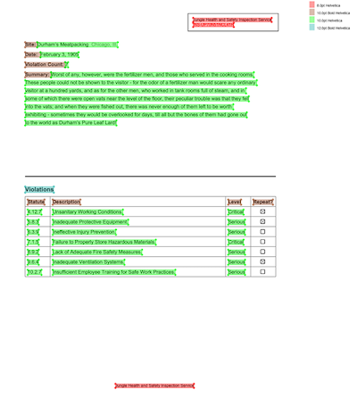

# Natural PDF

[](https://github.com/jsoma/natural-pdf/actions/workflows/ci.yml)

A friendly library for working with PDFs, built on top of [pdfplumber](https://github.com/jsvine/pdfplumber).

Natural PDF lets you find and extract content from PDFs using simple code that makes sense.

- [Complete documentation here](https://jsoma.github.io/natural-pdf)
- [Live demos here](https://colab.research.google.com/github/jsoma/natural-pdf/)

<div style="max-width: 400px; margin: auto"><a href="sample-screen.png"></a></div>

## Installation

```bash
pip install natural-pdf
```

Need OCR, semantic search, export, or AI-powered extraction? Install what you need:

```bash
pip install "natural-pdf[all]"      # Recommended feature-complete install
pip install "natural-pdf[export]"   # Export helpers only
pip install easyocr                 # Extra OCR backend
pip install "natural-pdf[paddle]"   # PaddleOCR stack
pip install "surya-ocr<0.15"        # Surya OCR engine
pip install doctr                   # Doctr OCR engine
```

More details in the [installation guide](https://jsoma.github.io/natural-pdf/installation/).

`natural-pdf[all]` is the recommended feature-complete install for core features: the default RapidOCR engine, sentence-transformers-based semantic search, QA/extraction dependencies, and export support. It does not install every optional backend. Extra engines such as PaddleOCR, Surya, and Doctr stay opt-in, and Natural PDF will tell you what to install when you try to use something that is missing.

## Quick Start

```python
from natural_pdf import PDF

# Open a PDF
pdf = PDF('https://github.com/jsoma/natural-pdf/raw/refs/heads/main/pdfs/01-practice.pdf')
page = pdf.pages[0]

# Extract all of the text on the page
page.extract_text()

# Find elements using CSS-like selectors
heading = page.find('text:contains("Summary"):bold')

# Extract content below the heading
content = heading.below().extract_text()

# Examine all the bold text on the page
page.find_all('text:bold').show()

# Exclude parts of the page from selectors/extractors
header = page.find('text:contains("CONFIDENTIAL")').above()
footer = page.find_all('line')[-1].below()
page.add_exclusion(header)
page.add_exclusion(footer)

# Extract clean text from the page ignoring exclusions
clean_text = page.extract_text()
```

And as a fun bonus, `page.viewer()` will provide an interactive method to explore the PDF.

## Key Features

Natural PDF offers a range of features for working with PDFs:

*   **CSS-like Selectors:** Find elements using intuitive query strings (`page.find('text:bold')`).
*   **Spatial Navigation:** Select content relative to other elements (`heading.below()`, `element.select_until(...)`).
*   **Text & Table Extraction:** Get clean text or structured table data, automatically handling exclusions.
*   **OCR Integration:** Extract text from scanned documents using engines like EasyOCR, PaddleOCR, or Surya.
*   **Layout Analysis:** Detect document structures (titles, paragraphs, tables) using various engines (e.g., YOLO, Paddle, LLM via API).
*   **Document QA:** Ask natural language questions about your document's content.
*   **Semantic Search:** Rank pages within a PDF by semantic similarity using sentence-transformer embeddings.
*   **Visual Debugging:** Highlight elements and use an interactive viewer or save images to understand your selections.

## Learn More

Dive deeper into the features and explore advanced usage in the [**Complete Documentation**](https://jsoma.github.io/natural-pdf).

## Extending Natural PDF

Natural PDF now exposes its pluggable engines through small helper functions so you rarely have to touch the core registry directly. Two handy entry points:

```python
from natural_pdf.tables import register_table_function

def table_delim(region, *, context=None, **kwargs):
    # return a TableResult or list-of-lists
    ...

register_table_function("table_delim", table_delim)
```

```python
from natural_pdf.selectors import register_selector_engine

class DebugSelectorEngine:
    def query(self, *, context, selector, options):
        ...

register_selector_engine("debug", lambda **_: DebugSelectorEngine())
```


## Best friends

Natural PDF sits on top of a *lot* of fantastic tools and mdoels, some of which are:

- [pdfplumber](https://github.com/jsvine/pdfplumber)
- [EasyOCR](https://www.jaided.ai/easyocr/)
- [PaddleOCR](https://paddlepaddle.github.io/PaddleOCR/latest/en/index.html)
- [Surya](https://github.com/VikParuchuri/surya)
- A specific [YOLO](https://github.com/opendatalab/DocLayout-YOLO)
- [doctr](https://github.com/mindee/doctr)
- [docling](https://github.com/docling-project/docling)
- [Hugging Face](https://huggingface.co/models)
