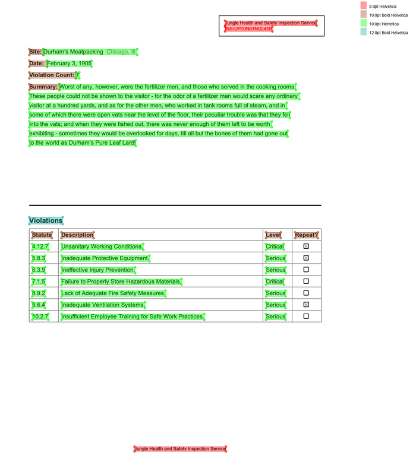

# Natural PDF

A Python library for PDF extraction built on [pdfplumber](https://github.com/jsvine/pdfplumber). Find and extract content using CSS-like selectors and spatial navigation. Simple code that makes sense.

Demos:

- [Basics](https://colab.research.google.com/github/jsoma/natural-pdf-workshop/blob/main/docs/01-Natural%20PDF%20basics%20with%20text%20and%20tables-ANSWERS.ipynb)
- [OCR and scanned PDFs](https://colab.research.google.com/github/jsoma/natural-pdf-workshop/blob/main/docs/02-OCR%20and%20AI%20magic-ANSWERS.ipynb)
- [AI and data extraction](https://colab.research.google.com/github/jsoma/natural-pdf-workshop/blob/main/docs/03-AI%20and%20data%20extraction-ANSWERS.ipynb)
- [Columns, multi-page flows](https://colab.research.google.com/github/jsoma/natural-pdf-workshop/blob/main/docs/04-Page%20structure-ANSWERS.ipynb)

<div style="max-width: 400px; margin: auto"><a href="assets/sample-screen.png"></a></div>

## Installation

```
pip install natural-pdf
# All the extras
pip install "natural-pdf[all]"
```

## Quick Example

```python
from natural_pdf import PDF

pdf = PDF('https://github.com/jsoma/natural-pdf/raw/refs/heads/main/pdfs/01-practice.pdf')
page = pdf.pages[0]

# Find the title and get content below it
title = page.find('text:contains("Summary"):bold')
content = title.below().extract_text()

# Exclude everything above 'CONFIDENTIAL' and below last line on page
page.add_exclusion(page.find('text:contains("CONFIDENTIAL")').above())
page.add_exclusion(page.find_all('line')[-1].below())

# Get the clean text without header/footer
clean_text = page.extract_text()
```

## Getting Started

### New to Natural PDF?
- **[Choose Your Path](getting-started/choose-your-path.md)** - Find the best starting point for your background and goals
- **[Installation](installation/)** - Get Natural PDF installed and run your first extraction
- **[Quickstart](getting-started/quickstart.md)** - Jump in with a hands-on introduction
- **[Selectors 101](getting-started/selectors.md)** - Learn the selector syntax for finding elements
- **[Concepts](getting-started/concepts.md)** - Understand the core ideas behind Natural PDF

### Tutorials
Follow the tutorial series to learn Natural PDF systematically:

1. [Loading PDFs](tutorials/01-loading-and-extraction.ipynb) - Load PDFs and extract basic text
2. [Finding Elements](tutorials/02-finding-elements.ipynb) - Use selectors to locate content
3. [Spatial Navigation](tutorials/08-spatial-navigation.ipynb) - Navigate relative to elements
4. [Tables](tutorials/04-table-extraction.ipynb) - Extract and process tabular data
5. [Exclusions](tutorials/05-excluding-content.ipynb) - Remove headers, footers, and unwanted content
6. [OCR](tutorials/12-ocr-integration.ipynb) - Extract text from scanned documents
7. [Layout Analysis](tutorials/07-layout-analysis.ipynb) - Detect document structure automatically
8. [Regions & Flows](tutorials/15-working-with-regions.ipynb) - Work with document regions and multi-page flows
9. [Document QA](tutorials/06-document-qa.ipynb) - Ask questions and extract structured data
10. [Batch Processing](cookbook/batch-processing.md) - Process multiple PDFs efficiently

## Key Features

### Find Elements with Selectors

Use CSS-like selectors to find text, shapes, and more.

```python
# Find bold text containing "Revenue"
page.find('text:contains("Revenue"):bold').extract_text()

# Find all large text
page.find_all('text[size>=12]').extract_text()
```

### Navigate Spatially

Move around the page relative to elements, not just coordinates.

```python
# Extract text below a specific heading
intro_text = page.find('text:contains("Introduction")').below().extract_text()

# Extract text from one heading to the next
methods_text = page.find('text:contains("Methods")').below(
    until='text:contains("Results")'
).extract_text()
```

### Extract Clean Text

Easily extract text content, automatically handling common page elements like headers and footers (if exclusions are set).

```python
# Extract all text from the page (respecting exclusions)
page_text = page.extract_text()

# Extract text from a specific region
some_region = page.find(...)
region_text = some_region.extract_text()
```

### Apply OCR

Extract text from scanned documents using various OCR engines.

```python
# Apply OCR using the default engine
ocr_elements = page.apply_ocr()

# Extract text (will use OCR results if available)
text = page.extract_text()
```

### Analyze Document Layout

Use AI models to detect document structures like titles, paragraphs, and tables.

```python
# Detect document structure
page.analyze_layout()

# Highlight titles and tables
page.find_all('region[type=title]').show()
page.find_all('region[type=table]').show()

# Extract data from the first table
table_data = page.find('region[type=table]').extract_table()
```

### Document Question Answering

Ask natural language questions directly to your documents.

```python
# Ask a question
result = page.ask("What was the company's revenue in 2022?")
print(f"Answer: {result.answer}")
```

### Visualize Your Work

Debug and understand your extractions visually.

```python
# Highlight headings
page.find_all('text[size>=14]').show(color="red", label="Headings")

# Launch the interactive viewer (Jupyter)
page.viewer()
```

## Reference

- **[Quick Reference](quick-reference/)** - Essential commands and patterns in one place
- **[API Reference](api/)** - Complete library documentation
- **[Patterns & Pitfalls](for-llms/common-patterns.md)** - Common patterns and mistakes to avoid
- **[Troubleshooting](cookbook/troubleshooting.md)** - Solutions to common issues
