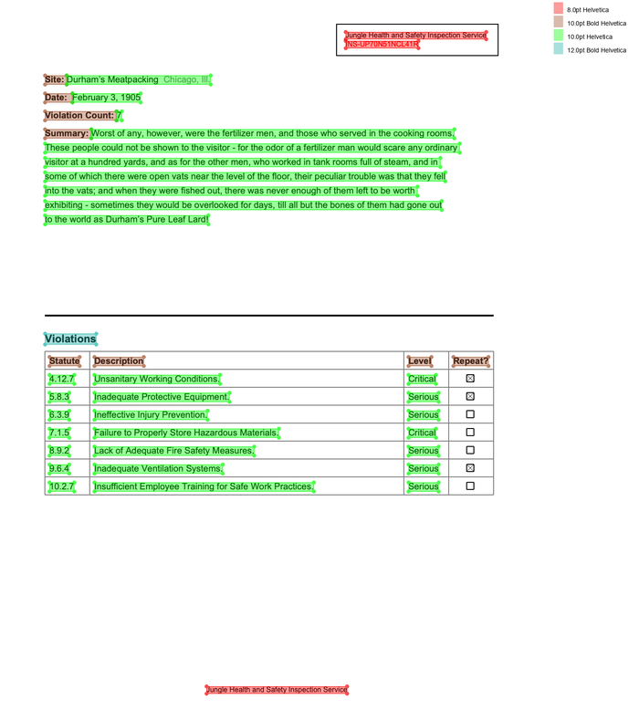

# Natural PDF

A Python library for PDF extraction built on [pdfplumber](https://github.com/jsvine/pdfplumber). Find and extract content using CSS-like selectors and spatial navigation. Simple code that makes sense.

Demos:

- [Basics](https://colab.research.google.com/github/jsoma/natural-pdf-workshop/blob/main/docs/01-Natural%20PDF%20basics%20with%20text%20and%20tables-ANSWERS.ipynb)
- [OCR and scanned PDFs](https://colab.research.google.com/github/jsoma/natural-pdf-workshop/blob/main/docs/02-OCR%20and%20AI%20magic-ANSWERS.ipynb)
- [AI and data extraction](https://colab.research.google.com/github/jsoma/natural-pdf-workshop/blob/main/docs/03-AI%20and%20data%20extraction-ANSWERS.ipynb)
- [Columns, multi-page flows](https://colab.research.google.com/github/jsoma/natural-pdf-workshop/blob/main/docs/04-Page%20structure-ANSWERS.ipynb)

<div style="max-width: 400px; margin: auto"><a href="assets/sample-screen.png"></a></div>

## Installation

```
pip install natural-pdf
# All the extras
pip install "natural-pdf[all]"
```

## Quick Example

```python
from natural_pdf import PDF

pdf = PDF('https://github.com/jsoma/natural-pdf/raw/refs/heads/main/pdfs/01-practice.pdf')
page = pdf.pages[0]

# Find the title and get content below it
title = page.find('text:contains("Summary"):bold')
content = title.below().extract_text()

# Exclude everything above 'CONFIDENTIAL' and below last line on page
page.add_exclusion(page.find('text:contains("CONFIDENTIAL")').above())
page.add_exclusion(page.find_all('line')[-1].below())

# Get the clean text without header/footer
clean_text = page.extract_text()
```

## Where to Go

The documentation is organized into six sections:

- **[Get Started](get-started/index.md)** - Install Natural PDF (base vs. `[all]`), open a PDF, and extract your first value and table. Includes a [translation guide for pdfplumber users](get-started/from-pdfplumber.md).
- **[Learn](learn/index.md)** - A six-part course: [text and tables](learn/01-text-and-tables.md), [OCR](learn/02-ocr.md), [AI extraction](learn/03-ai-extraction.md), [page structure](learn/04-page-structure.md), [grids](learn/05-grids.md), and [putting it together across whole documents](learn/06-putting-it-together.md).
- **[Concepts](concepts/index.md)** - How the library actually works: the [spatial model](concepts/spatial-model.md), [how text becomes elements](concepts/text-and-elements.md), [exclusions](concepts/exclusions.md), [selectors](concepts/selectors.md), [a table-extraction decision guide](concepts/tables.md), and [engines and models](concepts/engines-and-models.md).
- **[Solve](solve/index.md)** - Worked solutions to real problem documents: multi-column reflow, zebra-stripe tables, pixelated scans, multi-page tables, and more.
- **[Troubleshooting](troubleshooting/index.md)** - Symptom-indexed fixes for empty extractions, garbled text, missed rows, and OCR failures.
- **[For Agents](for-agents/index.md)** - Canonical patterns, return types, and anti-patterns for LLMs and coding agents writing Natural PDF code.

## Key Features

### Find Elements with Selectors

Use CSS-like selectors to find text, shapes, and more.

```python
# Find bold text containing "Revenue"
page.find('text:contains("Revenue"):bold').extract_text()

# Find all large text
page.find_all('text[size>=12]').extract_text()
```

### Navigate Spatially

Move around the page relative to elements, not just coordinates.

```python
# Extract text below a specific heading
intro_text = page.find('text:contains("Introduction")').below().extract_text()

# Extract text from one heading to the next
methods_text = page.find('text:contains("Methods")').below(
    until='text:contains("Results")'
).extract_text()
```

### Extract Clean Text

Easily extract text content, automatically handling common page elements like headers and footers (if exclusions are set).

```python
# Extract all text from the page (respecting exclusions)
page_text = page.extract_text()

# Extract text from a specific region
some_region = page.find(...)
region_text = some_region.extract_text()
```

### Apply OCR

Extract text from scanned documents using various OCR engines.

```python
# Apply OCR using the default engine
page.apply_ocr()

# Select the OCR text if you need the created elements
ocr_elements = page.find_all("text[source=ocr]")

# Extract text (will use OCR results if available)
text = page.extract_text()
```

OCR supports recognition (default), detection refresh (`detect_only=True`),
and custom recognition (`function=`). Replacement is strict:
`replace="ocr"`, `"all"`, or `"none"`; booleans and the removed
`ocr_function=` keyword are rejected. Detection preserves existing native and
recognized text. `PDF.apply_ocr` also supports `pages=` and `show_progress=`;
`PDFCollection.apply_ocr` supports `max_workers=`.

### Analyze Document Layout

Use AI models to detect document structures like titles, paragraphs, and tables.

```python
# Detect document structure
page.analyze_layout()

# Highlight titles and tables
page.find_all('region[type=title]').show()
page.find_all('region[type=table]').show()

# Extract data from the first table
table_data = page.find('region[type=table]').extract_table()
```

### Recover Difficult Tables

Use guides and row anchors when a table is visually clear but automatic table
extraction misses rows or columns.

```python
header = page.find('text:contains("CASE #")')
texts = list(page.find_all("text"))
header_row = [el for el in texts if abs(el.top - header.top) <= 2]
row_anchors = [
    el
    for el in texts
    if el.extract_text().strip().startswith("23-") and el.top > header.top
]

df = page.extract_table_guided(
    header_row,
    row_anchors,
    cell_extract="words",
    cell_overlap="center",
).to_df()
```

For row-shaped content that is not a full table, use stable visual anchors:

```python
rows = pdf.pages.extract_anchored_rows(
    lambda page: [
        el
        for el in page.find_all("text")
        if el.extract_text().strip().isdigit() and el.x1 < 70
    ],
    side="right",
)
clean_lines = [row.text for row in rows]
```

### Document Question Answering

Ask natural language questions directly to your documents.

```python
# Ask a question
result = page.ask("What was the company's revenue in 2022?")
print(f"Answer: {result.answer}")
```

### Visualize Your Work

Debug and understand your extractions visually.

```python
# Highlight headings
page.find_all('text[size>=14]').show(color="red", label="Headings")

# Launch the interactive viewer (Jupyter)
page.viewer()
```

## Reference

- **[Selector Reference](reference/selectors.md)** - Every selector, pseudo-class, and attribute filter
- **[Engine Reference](reference/engines.md)** - OCR, layout, and extraction engines with install commands
- **[Installation Extras](reference/installation-extras.md)** - What each `pip install "natural-pdf[...]"` extra contains
- **[API Reference](api/index.md)** - Complete library documentation
